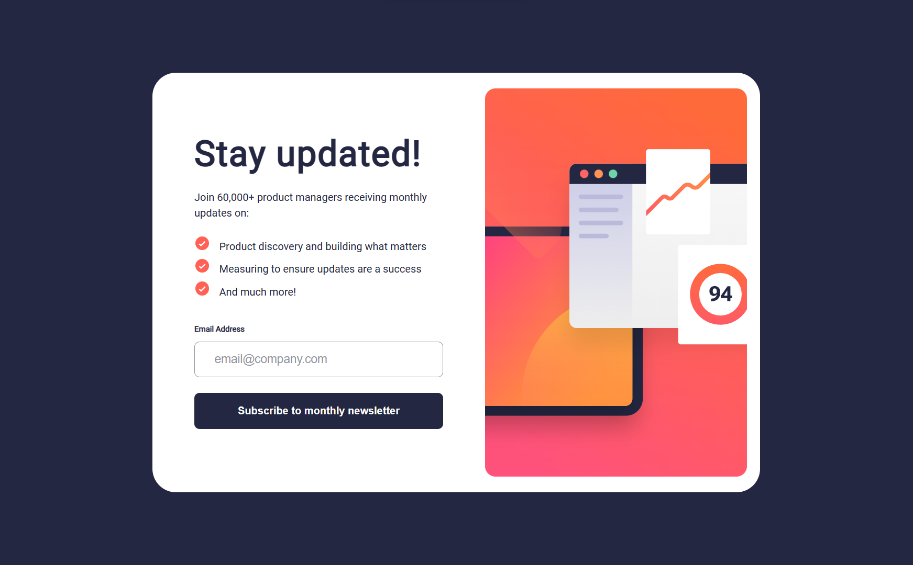

# Frontend Mentor - Newsletter sign-up form with success message solution

This is a solution to the [Newsletter sign-up form with success message challenge on Frontend Mentor](https://www.frontendmentor.io/challenges/newsletter-signup-form-with-success-message-3FC1AZbNrv). Frontend Mentor challenges help you improve your coding skills by building realistic projects.

## Table of contents

- [Overview](#overview)
  - [The challenge](#the-challenge)
  - [Screenshot](#screenshot)
  - [Links](#links)
- [My process](#my-process)
  - [Built with](#built-with)
  - [What I learned](#what-i-learned)
  - [Useful resources](#useful-resources)
- [Author](#author)
- [Acknowledgments](#acknowledgments)

## Overview

### The challenge

Users should be able to:

- Add their email and submit the form
- See a success message with their email after successfully submitting the form
- See form validation messages if:
  - The field is left empty
  - The email address is not formatted correctly
- View the optimal layout for the interface depending on their device's screen size
- See hover and focus states for all interactive elements on the page

### Screenshot

### Links

- Solution URL: [Solution](https://github.com/Himanshu-196018/newsletter-sign-up)
- Live Site URL: [Demo/site](https://newsletter-sign-up-himanshu-2301.netlify.app/)

## My process

### Built with

- Semantic HTML5 markup
- CSS custom properties
- Flexbox
- CSS Grid
- Mobile-first workflow
- [React](https://reactjs.org/) - JS library

### What I learned

This is my first self made React project. I learnt a lot of things while buildings this project. I learned about react components and states with `useState` hooks. React doesn't allow to interect wiht DOM directly, it creates a virtual DOM and manage it through states. I also learned conditional rendering of components on user interaction.

### Useful resources

- [Markdown](https://www.markdownguide.org/) - This helped me to understand and write down markdown.

- [W3School](https://www.w3schools.com/) - Free Resources for most of the programming languages with detailed examples.

- [react.dev](https://react.dev/) - official react documention to learn react.

## Author

- Website - [Himanshu]("")
- Github - [@Himanshu_196018](https://github.com/Himanshu-196018)
- LinkedIn - [@Himanshu](www.linkedin.com/in/himanshu-kumar-2b7993167)

## Acknowledgments

I would personally recommend to checkout [Frontend Mentor](https://www.frontendmentor.io/). This is a very useful site, it will help you to improve your Frontend Developing skills by building projects through challanges.
